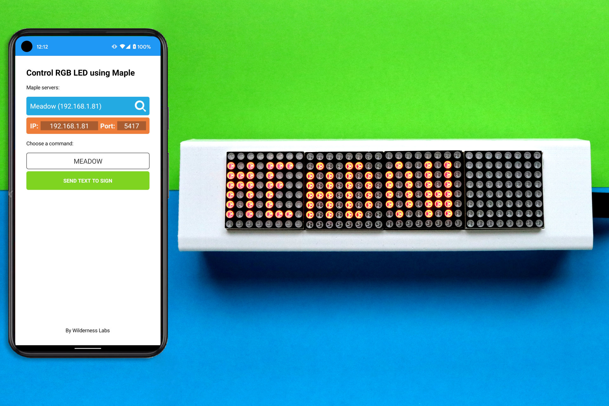
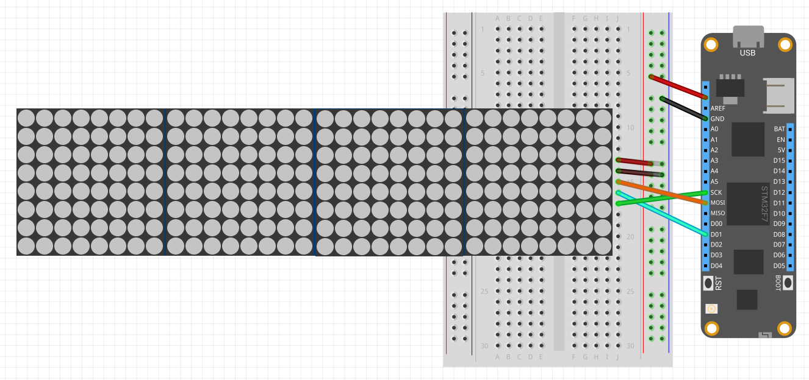

# OnAir Sign

OnAir Sign is a WiFi-controlled, Meadow-powered, interactive sign.

It runs Maple.Server, which allows you to control the text on a MAX7219 LED matrix display via a Web API. It also includes a version that you can build with a [Hack Kit](https://store.wildernesslabs.co/collections/frontpage/products/meadow-f7-micro-development-board-w-hack-kit-pro) using the LCD Character Display.

## OnAir Sign Circuit

For this project you need to connect an array of 4 Max7219 LED dot matrix to Meadow's ISP pins as shown in the Fritzing Diagram below:

## Projects

* **OnAir_Sign.Client** - Xamarin.Forms application that listens to Maple's UDP broadcasts to obtain the server and sends GET requests to Meadow to display text on the LED display.
* **OnAir_Sign.Client.Android** - Android platform specific project.
* **OnAir_Sign.Client.iOS** - iOS platform specific project.
* **OnAir_Sign.Client.UWP** - UWP platform specific project.
* **OnAir_Sign.Meadow** - A meadow application that runs a Maple server, broadcasting the server information in the network and taking GET requests to show text on the MAX7212 
* **OnAir_Sign.Meadow.HackKit** - Same meadow application with the difference of using a Character Display including in the Hack Kit.

## Authors

Bryan Costanich
