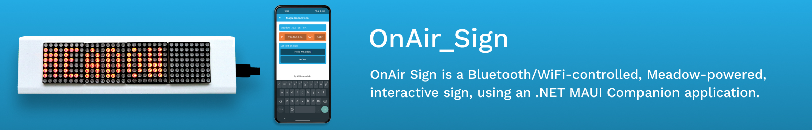

# OnAir_Sign

OnAir Sign is a Bluetooth/WiFi-controlled, Meadow-powered, interactive sign, using an .NET MAUI Companion application.

It runs Maple.Server, which allows you to control the text on a MAX7219 LED matrix display via a Web API. It also includes a version that you can build with a [Hack Kit](https://store.wildernesslabs.co/collections/frontpage/products/meadow-f7-micro-development-board-w-hack-kit-pro) using the LCD Character Display.

# OnAir Sign Circuit

For this project you need to connect an array of 4 Max7219 LED dot matrix to Meadow's ISP pins as shown in the Fritzing Diagram below:

# Companion Phone App

This project also comes with a .NET MAUI OnAir_Sign companion app (on Android and iOS) that shows you how to communicate with your Meadow device using [Bluetooth](http://developer.wildernesslabs.co/Meadow/Meadow.OS/Bluetooth/) and [Maple](http://developer.wildernesslabs.co/Meadow/Meadow.Foundation/Libraries_and_Frameworks/Maple.Server/) for both versions.

# Solution Structure

* **CommonContracts** - Shared projects to share common constants like Bluetooth characteristics IDs, models, etc.
* **MeadowOnAir_Sign** - A meadow application that runs a Maple server, broadcasting the server information in the network and taking GET requests to show text on the MAX7212. It can also run as a Bluetooth server, so its paired with its companion app to set texts on the display.
* **MeadowOnAir_Sign.HackKit** - Same meadow application with the difference of using a Character Display including in the Hack Kit.
* **MobileOnAir_Sign** - .NET MAUI application that listens to Maple's UDP broadcasts to obtain the server and sends GET requests to Meadow to display text on the LED display.